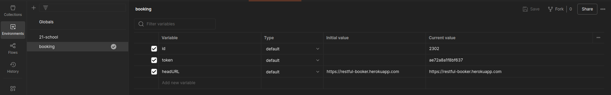
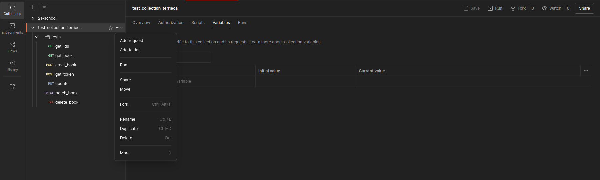
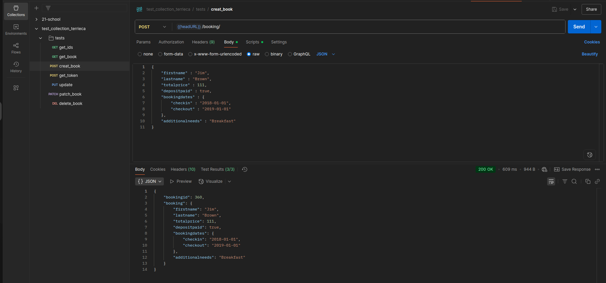
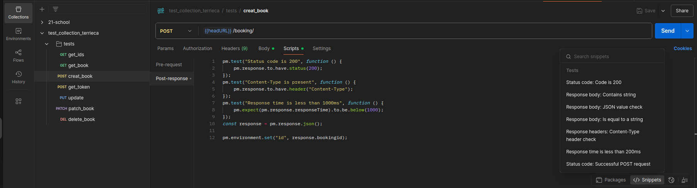
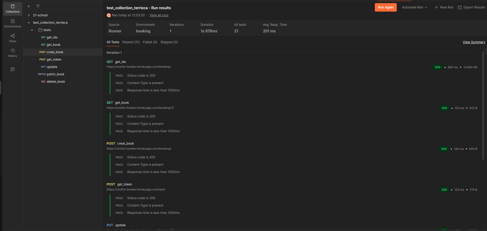

# Postman


В качестве сайта, для тестирования api был выбран сайт https://restful-booker.herokuapp.com


## Функциональности Postman: настройка окружения, создание коллекций, создание запросов в коллекциях, добавление сниппетов, запуск автотестов для коллекции.

### Настройка окружения.
1. Откройте приложение Postman.
2. В меню слева выберите вкладку **Environments**.
3. Нажмите на кнопку "+" (**Creat new Environments**), создастся новое окружение **New Environment**, нажав на которое можно изменить название и
добавить необходимые переменные и их значения. 
4. Сохраните настройки нажатием кнопки **Save**.


   
Чтобы окружение работало в коллекции, необходимо выбрать его, поставив галочку, как на скриншоте.

Чтобы использовать переменные в запросах, нужно использовать определённый синтаксис для обращения к переменным окружения, например, в секции запросов можно заменить https://restful-booker.herokuapp.com на переменную ```{{headURL}}```

Настройка окружения в Postman значительно облегчает тестирование различных сред разработки, позволяя гибко управлять настройками вашего приложения.


### Cоздание коллекций.

1. Откройте приложение Postman.
2. В меню слева выберите вкладку **Collections**.
3. Нажмите на кнопку "+" (**Creat new Collection**), создастся новое окружение **New Collection**, нажав на которое можно изменить название и
добавить описание. 
4. Для удобства работы создайте одну или несколько папок внутри коллекции, нажав на ```...``` и выбрав **add folder**

При создании папок появится возможность сразу создавать запросы прямо внутри них, что удобно для организации связанных групп запросов.



### Добавление запросов в коллекцию.


1. Чтобы создать новый запрос нажмите на ```...``` рядом с коллекцией или папкой в коллекции и выберите **add request**, после чего создастся новый запрос **New Request**.

2. Нажмите на него для редактирования:

- Введите понятное имя, отражающее суть запроса.
- Выберите подходящий метод: GET, POST, PUT, DELETE и др., в зависимости от типа операции.
- Поле адреса сервера (**URI**) — введите полный адрес конечной точки API, например, `https://restful-booker.herokuapp.com/booking`.

3. Нажмите кнопку **Save**. Ваш запрос сохранится в выбранной папке или коллекции.

4. Отредактируйте параметры запроса:


- **Body (Тело запроса)**
Здесь задаются параметры тела запроса (для методов POST, PUT и PATCH) в формате ключ-значение.

- **Headers (Заголовки)**
Задайте нужные заголовки для запроса, такие как Content-Type, Accept и аутентификационные токены.

- **Authorization (Авторизация)**
Здесь можно выбрать один из методов авторизации.

- **Scripts (Скриптовые сценарии)**
Используются для автоматического запуска сценариев перед выполнением запроса и проверки результатов после выполнения.

5. Нажмите кнопку **Send**, чтобы отправить ваш запрос серверу и увидеть ответ. Ответ будет отображён ниже формы запроса вместе с информацией о статусе, заголовках и теле ответа.




### Cниппеты.

Сниппет в Postman — это готовый фрагмент кода (например, на JavaScript), который можно быстро вставить в Pre-request Script или Tests для автоматизации запросов, проверки ответов или настройки переменных.

Сниппеты помогают:

- Тестировать API (проверка статус-кода, тела ответа).
- Генерировать динамические данные (токены, даты).
- Упрощать повторяющиеся задачи.

Чтобы вставить сниппет необходимо во вкладке **Scripts** в правом нижнем углу нажать на ```snippets``` и выбрать из выпадающего меню предлагаеммый сниппет.




### Запуск автотестов для коллекции.

Чтобы запустить автотесты нажмите на ```...``` рядом с коллекцией и нажмите на **run**, произойдёт переход в **Collection Runner**, где можно задать параметры для выполнения тестов:

- **Iterations**: установите количество итераций, на протяжении которого будут выполняться запросы. По умолчанию одна итерация выполняется единожды.
- **Delay request**: выставьте задержку между запросами (полезно, если сервис чувствителен к нагрузкам).
- **Data file**: если требуется, загрузите CSV-файл или raw data для каждой итерации (используется для подстановки уникальных данных в каждую итерацию).

После выбора нужных настроек нажмите кнопку **Run**.

Postman запустит серию запросов согласно указанным параметрам и соберёт результаты.

После выполнения тестов можно экспортировать результаты, нажав на кнопку **Export Results**.

